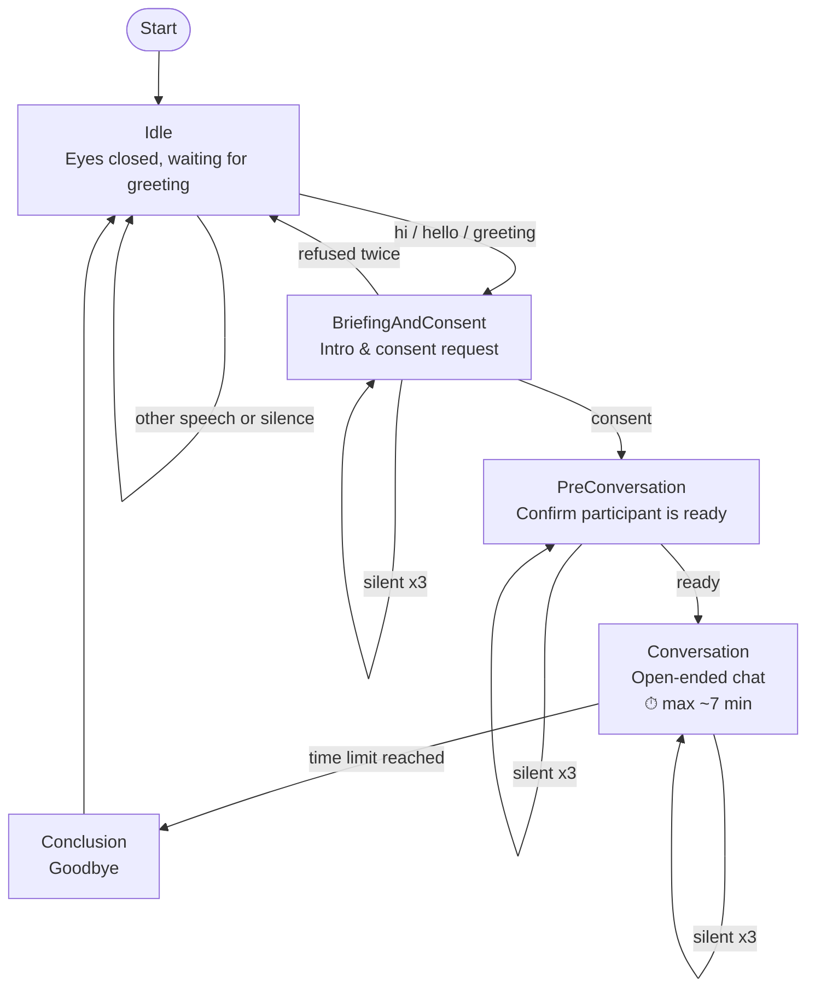

# Furhat Eye-Tracking Research Study

An automated FurhatOS skill for an eye-tracking research study. The robot assistant (**Iris**) wakes on a greeting, requests consent, then holds an open-ended conversation while eye-tracking data is recorded externally.

## Features

- **Greeting-Triggered Start**: Iris stays idle with eyes closed until a participant says hi.
- **Consent Phase**: Verbal consent capture with question handling and a quiet-mode fallback after repeated silence.
- **Open-Ended Conversation**: Single chat task introducing Iris and inviting the participant to share their name, what they do, and stories — capped at ~7 minutes.
- **Gemini-Powered Dialogue**: Dynamic follow-ups and intent classification via Gemini, with configurable thinking budget and token limits.
- **Automated Test Agents**: Python-based simulators using macOS TTS to automate interaction testing.

## Project Structure

```text
src/main/kotlin/furhatos/app/eyetracking/
├── flow/
│   ├── init.kt         # Skill entry point and startup
│   └── interaction.kt  # All study states and conversation flow
├── setting/
│   └── persona.kt      # Iris persona, voice, and chatbot system prompt
├── chatbot/
│   └── gemini.kt       # Gemini API integration, token logging, intent classifier
└── main.kt             # Skill configuration

docs/
├── api.md           # Gemini model, timeouts, retry logic, token logging
├── speech.md        # ASR endSil/timeout values, TTS voice fallback chain
├── conversation.md  # Flow states, persona, tone, silence handling
├── errors.md        # Fallback strings and when each triggers
└── prompts.md       # All spoken lines by state (kept in sync with interaction.kt)
tests/
├── test_runner.py       # Happy path test agent
├── test_error_paths.py  # Error recovery and silence timeout test agent
├── test_quit_path.py    # Early termination path test agent
└── build_and_test.py    # Master test suite
```

## Conversation Flow



> At each checkpoint, participant questions are answered live by the Gemini chatbot before re-listening. After 3 consecutive silences, Iris enters "quiet mode" and waits indefinitely instead of ending the session.

## Setup

1. **Build**:
   ```bash
   ./gradlew shadowJar
   ```
2. **Run locally** (requires Furhat simulator running on port 1932):
   ```bash
   ./gradlew run
   ```
3. **API Key**: Set your Gemini API key in `local.properties` as `gemini.api.key=YOUR_KEY`, or export `GEMINI_API_KEY` in your shell. The file is gitignored. The key is read at startup; the skill exits if it is missing.

## Automated Testing

Requires the Furhat simulator to be running before executing any test.

- **Run master test suite**:
  ```bash
  python3 tests/build_and_test.py
  ```
- **Run individual tests**:
  - `python3 tests/test_runner.py` — Happy path (greet, consent, ~4 conversational turns)
  - `python3 tests/test_error_paths.py` — Unhappy path (off-topic answers, hesitation, silence recovery)
  - `python3 tests/test_quit_path.py` — Edge-exit paths (consent refusal returns to Idle, silence enters quiet mode)

## Requirements

- [FurhatOS SDK](https://furhatrobotics.com/docs/)
- Python 3 (for test agents)
- Gemini API Key
