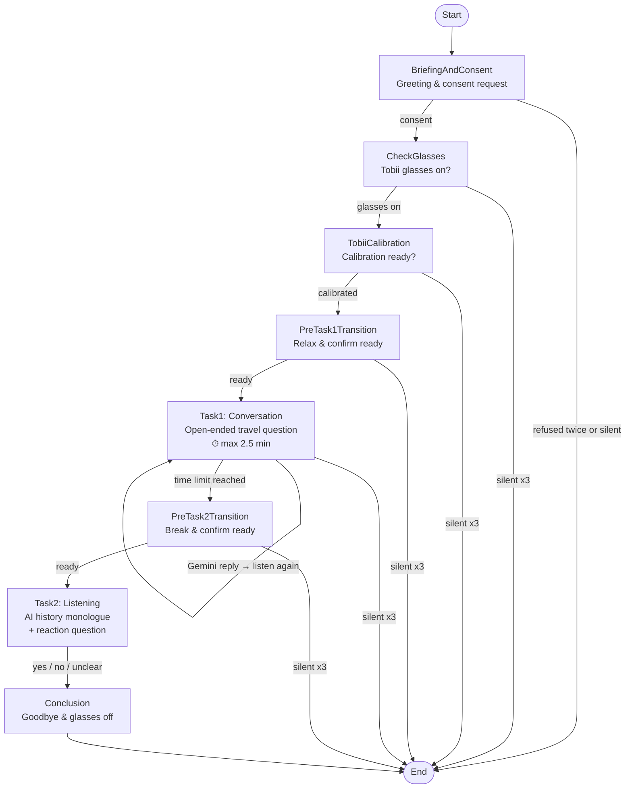

# Furhat Eye-Tracking Research Study

An automated FurhatOS skill for an eye-tracking research study. The robot assistant (**Iris**) guides participants through consent, glasses setup, Tobii calibration, and two conversational tasks.

## Features

- **Automated Research Flow**: Guided process from consent to study completion.
- **Eye-Tracking Integration**: Waits for Tobii calibration success before proceeding.
- **Dual-Task Structure**:
    - **Task 1**: Open-ended conversation about a favorite travel destination.
    - **Task 2**: Listening task — short AI history monologue followed by a reflection question.
- **Gemini-Powered Dialogue**: Dynamic follow-up questions and intent classification via Gemini API, with configurable thinking budget and token limits.
- **Automated Test Agents**: Python-based simulators using macOS TTS to automate interaction testing.

## Project Structure

```text
src/main/kotlin/furhatos/app/eyetracking/
├── flow/
│   ├── init.kt         # Skill entry point and startup
│   └── interaction.kt  # All study states and conversation flow
├── setting/
│   └── persona.kt      # Iris persona, voice, and chatbot system prompt
├── chatbot/
│   └── gemini.kt       # Gemini API integration, token logging, intent classifier
└── main.kt             # Skill configuration

docs/
└── ASSISTANT_PROMPTS.md  # Reference doc — all spoken lines and system prompt
tests/
├── test_runner.py       # Happy path test agent
├── test_error_paths.py  # Error recovery and silence timeout test agent
├── test_quit_path.py    # Early termination path test agent
└── build_and_test.py    # Master test suite
```

## Conversation Flow



> At each checkpoint, participant questions are answered live by the Gemini chatbot before re-listening.

## Setup

1. **Build**:
   ```bash
   ./gradlew shadowJar
   ```
2. **Run locally** (requires Furhat simulator running on port 1932):
   ```bash
   ./gradlew run
   ```
3. **API Key**: Set your Gemini API key in `src/main/kotlin/furhatos/app/eyetracking/chatbot/gemini.kt`.

## Automated Testing

Requires the Furhat simulator to be running before executing any test.

- **Run master test suite**:
  ```bash
  python3 tests/build_and_test.py
  ```
- **Run individual tests**:
  - `python3 tests/test_runner.py` — Happy path (full session, no friction)
  - `python3 tests/test_error_paths.py` — Unhappy path (refusals, silence, recovery)
  - `python3 tests/test_quit_path.py` — Early termination (consent refusal, silence quit)

## Requirements

- [FurhatOS SDK](https://furhatrobotics.com/docs/)
- Python 3 (for test agents)
- Gemini API Key
